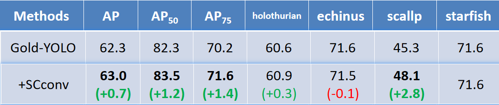

# UnderwaterObjectDetection
水下目标检测

数据集说明：

数据集相对路径：
采用数据格式：COCO
- DUO
	- images
		- train
		- test
	- labels
		- train
		- test

## BaseLine：Gold-YOLO

## 模型改进：
1. Gold-YOLO - Flatten
	
	1. 具体改进：在Gold-YOLO【Neck】部分将SoftMax注意力换成Flatten注意力。
	
	2. 实验权重：weights/Gold-YOLO-Flatten.pt
	
	3. 实验效果：
	

2. Gold-YOLO - SCconv

   1. 具体改进：在在Gold-YOLO【repVggBlock】部分将通道数大于4的3x3卷积加上SCconv注意力。

   2. 实验权重：weights/Gold-YOLO-SCconv.pt

   3. 实验效果：

      
      
      